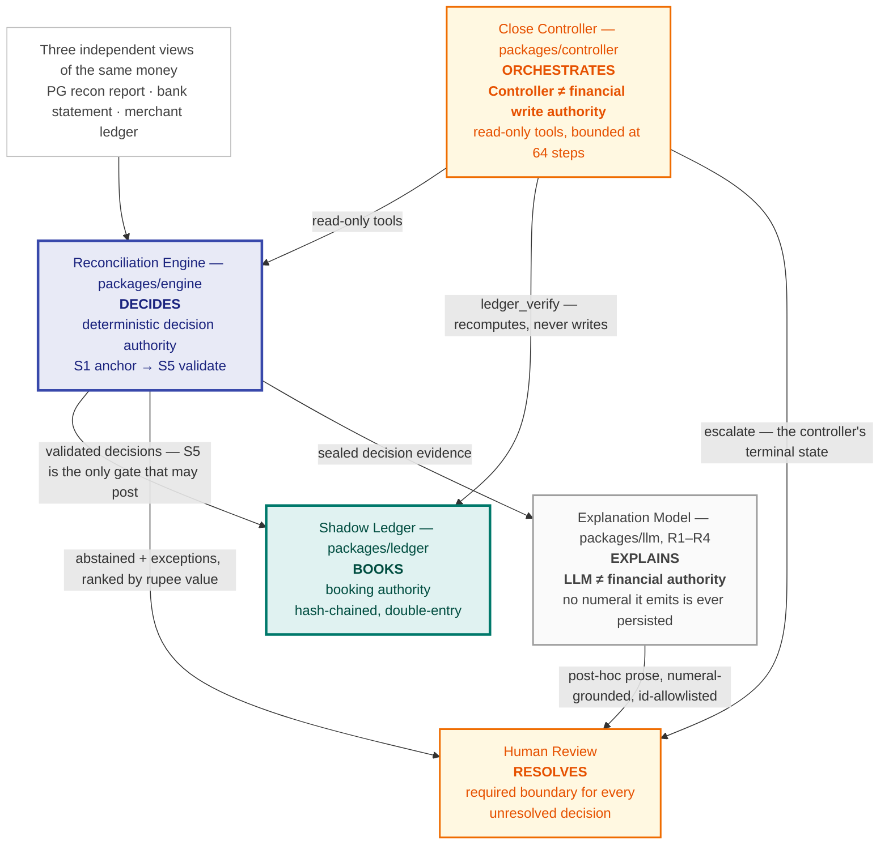
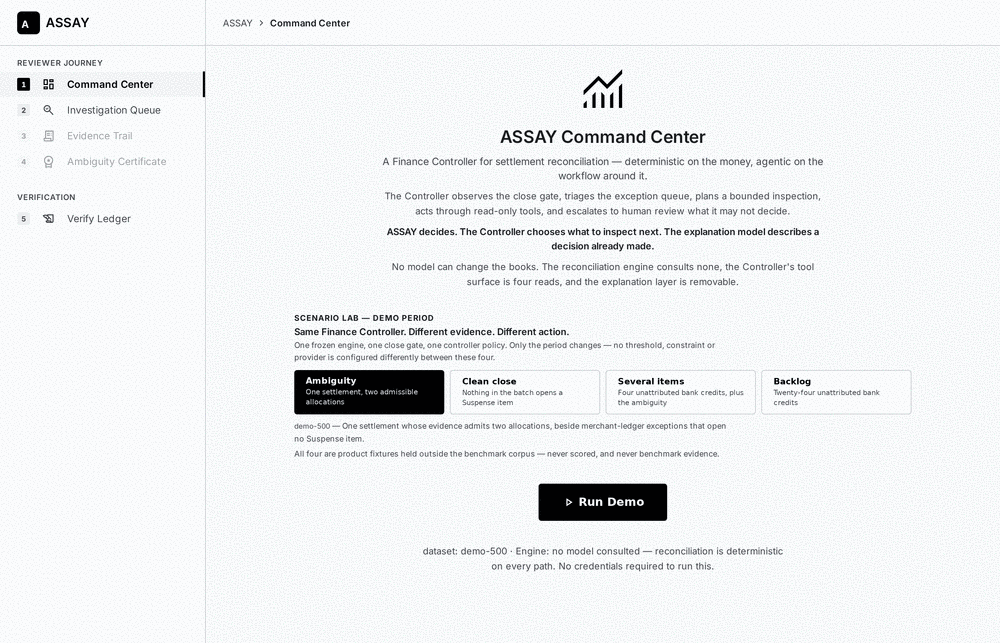
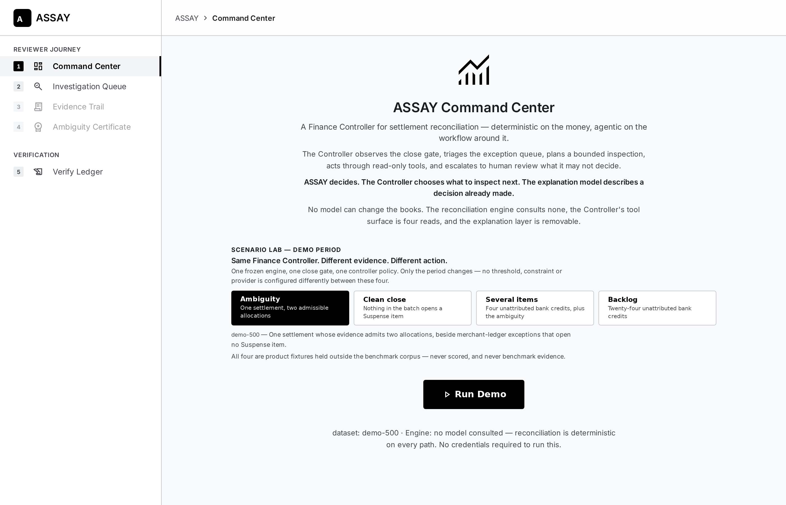
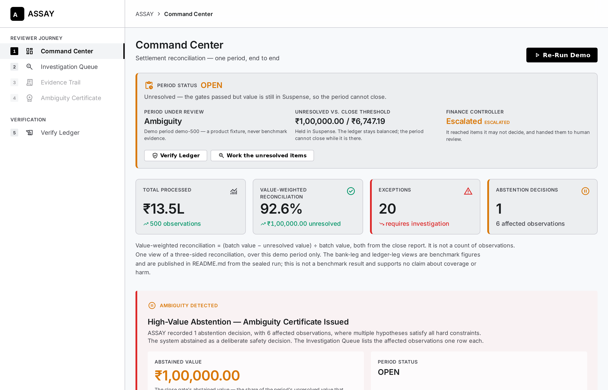
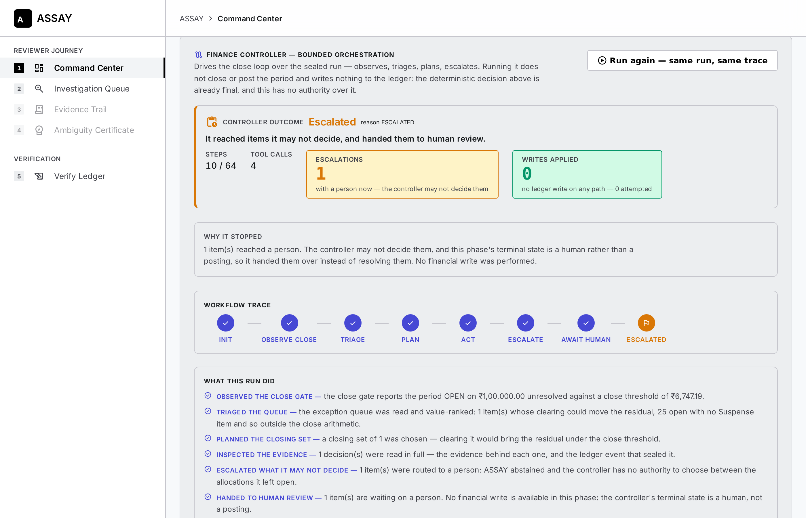
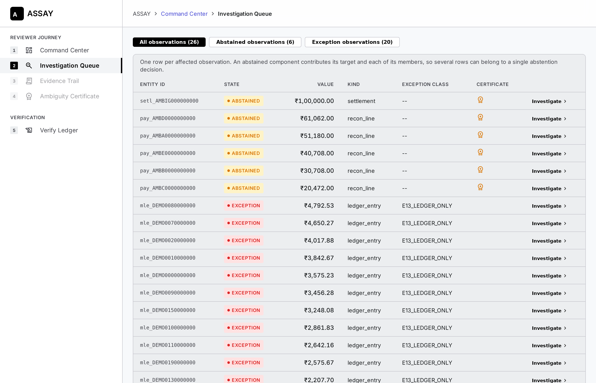
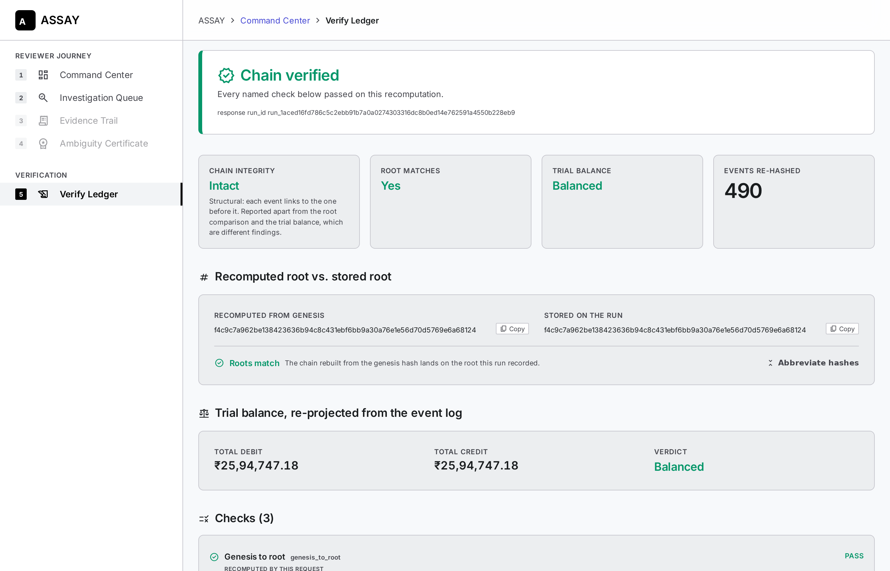

# ASSAY

**A settlement-reconciliation finance controller that treats uncertainty as a
first-class financial outcome.** Built for Razorpay-shaped payment data; it began
as a Razorpay AI Buildathon 2026 entry, Track 04: AI Finance Controller (see
[Provenance](#provenance-and-the-frozen-submission)).

ASSAY decides **what can be reconciled from the evidence**, **what must remain
unresolved**, and **when a case is routed to a human reviewer.** It reads three
independent views of the same money — the payment gateway's recon report, the
bank statement, and the merchant's own ledger — posts every decision into a
hash-chained double-entry shadow ledger, and **abstains with a machine-checkable
certificate** whenever the available evidence does not uniquely determine the
correct allocation — precisely: whenever **more than one allocation is admissible**
under the frozen hard constraints and the admissible allocations **differ
materially** in the books, or that difference cannot be established. ASSAY
abstains on **admissibility and materiality**, not on evidence scoring; the
evidence-score model is a design that is partly unimplemented, and
[*What the evidence model is*](#what-the-evidence-model-is-and-is-not) says which
part.

## Who decides what

Five things act on a settlement here, and **only one of them may decide, only
one may book, and neither of those is a language model.** The diagram is the
whole control argument; `docs/ARCHITECTURE.md §2` draws the same boundaries in
full and `§4` states what each one prevents.

Two of those boxes carry the whole safety argument: **the language model decides
nothing and the controller books nothing.** Everything below is the working.

| Component | Authority it has | Authority it does not have |
|---|---|---|
| **Reconciliation Engine** | The only component that decides an allocation, and `S5` is the only gate that may post | — |
| **Shadow Ledger** | The only component that books; every entry is hash-chained and replayable | Cannot be written except through a `ValidatedDecision` `S5` constructed |
| **Close Controller** | Reads, plans, escalates, within a step bound | **No financial write.** Its tool surface is four reads; its terminal state is human review, never a ledger event |
| **Explanation Model** | Explains a decision that has already been made and sealed | **Not a financial authority.** It decides nothing, emits no number that is persisted, and every id it names must already exist |
| **Human Review** | Resolves what the evidence could not | — |

**Unresolved decisions do not clear themselves.** An abstention or an exception
leaves the machine at a human, by construction — the escalation boundary is
where the system stops, not a fallback it takes when a heuristic is unsure.

## Verify it in sixty seconds

Three commands, two terminals, nothing to configure:

    pnpm install
    pnpm run dev:api                 # terminal 1 — binds 127.0.0.1:8787
    pnpm run verify:determinism      # terminal 2 — runs demo-500 twice and diffs

The second command runs the same period through the API twice, verifies each
ledger from genesis, and diffs the pair. This is the real output:

    verify:determinism  api=http://127.0.0.1:8787  dataset=demo-500

    run_id                  same       run_1aced16fd786c5c2ebb91b7a0a0274303316dc8b0ed14e762591a4550b228eb9
    ledger_root_hash        same       0797e8dd2d242cb7d6fe718d8e675bd71d3bb3e407131a8ece3c2a45f8f2a718
    recomputed_root_hash    same       0797e8dd2d242cb7d6fe718d8e675bd71d3bb3e407131a8ece3c2a45f8f2a718
    event_count             same       490
    total_dr_paise          same       259474718
    unresolved_value_paise  same       10000000

    run 1: chain recomputes genesis→root yes, trial balance ok (259474718 dr = 259474718 cr), period OPEN, 0.43s wall clock on this machine — not a throughput rate
    run 2: chain recomputes genesis→root yes, trial balance ok (259474718 dr = 259474718 cr), period OPEN, 0.39s wall clock on this machine — not a throughput rate

    PASS: 6 fields identical across two independent runs; both chains verify. The run id and root hash are functions of the input, not of a clock.
    Note: demo-500 is a product fixture, not benchmark evidence (see demo/README.md).

**Your machine prints the same two hashes.** The run id and the ledger root are
functions of the **input** — the observations, the frozen thresholds, the posting
rules — and not of a clock, a map-iteration order or a random seed. Two runs on
two machines a week apart reach `run_1aced16f…` and `0797e8dd…` or one of them
is wrong, and `GET /runs/:id/ledger/verify` recomputes the whole chain from
genesis to say which. (Before spec 1.4.39 the root was `f4c9c7a9…`; the run id
is unchanged. The root moved because the engine's version stamp enters the
genesis hash — `engine_commit: 1.4.38 → 1.4.39` — and for **no other reason**:
with the stamp equalised, the pre-fix and post-fix engines produce this run
byte-for-byte identically, because no demo-500 settlement reaches the branch
the fix changed. See *What the evidence model is* below.) `259474718 dr = 259474718 cr` is the trial balance closing
on the 490 events the run posted.

**What this does and does not show.** The ~half-second wall clock is for this
fixture on one laptop and is **not a throughput rate**; the benchmark's measured
figures are in [Benchmark disclosures](#benchmark-disclosures) with their own
limits. `demo-500` is a **product fixture**, placed outside `bench/` by
[`demo/README.md`](demo/README.md), unscored, and **not benchmark evidence**.
Determinism is the property a reviewer can check in a minute; accuracy is the
property the sealed benchmark measures, and this section claims nothing about it.

## What is built

- **Ten packages and three apps**, committed — `money`, `domain`, `ledger`,
  `engine`, `probe`, `oracle`, `generator`, `eval`, `llm`, `controller`, and
  `apps/cli`, `apps/api`, `apps/web`.
- **3,702 tests across 153 files**, with no type errors.
- **A sealed, signed benchmark** — sealed at spec version 1.4.37 under
  benchmark version 1.0.13, tag `bench-v1.0.13` (the engine is now at spec
  1.4.39 — see `V37` below; the sealed artifacts are untouched). `docs/PREREGISTRATION.md §9`'s eight steps were
  executed in order; step 7 wrote **50 conforming `metrics.json`** — five agents
  (`ASSAY`, `B0-IDONLY`, `A1-NOVALIDATE`, `A2-NOABSTAIN`, `A3-NOLLM`) × ten TEST
  seeds under `--llm=offline` — committed under
  [`runs/seal-v1.0.13/test/`](runs/seal-v1.0.13/test).
- **Byte-identical reproduction** — the same seed regenerates the same corpus
  byte for byte, and the same events rebuild the same ledger root hash; both are
  pinned by tests rather than asserted in prose.

**Three of `docs/DECISION_BRIEF.md §C`'s thirteen Tier-0 rows are not complete.**
They are named — not counted as done — in the disclosures below, alongside what
the sealed run does and does not support.

### Track 04's three asks, and the evidence for each

| Ask | The figure | Read from | Kind |
|---|---|---|---|
| **Throughput** | **15,726 observations per run** — TEST seeds `9000`–`9004`; 10,486 on the five adversarial seeds `9100`–`9104` | [`bench/test/<seed>/observations.jsonl`](bench/test), run end to end into [`runs/seal-v1.0.13/test/`](runs/seal-v1.0.13/test) | **Measured** — corpus volume per run, **not a rate** |
| **Measured accuracy** | `coverage_by_value` **0.9639 – 1.0000** per seed, published beside three lower coverage views | [`metrics.json`](runs/seal-v1.0.13/test) per seed; all four views, with numerators, under *Benchmark disclosures* | **Measured**, with the limitations below |
| **Honest exception list** | **3,770 – 3,787** open exceptions per seed (2,466 – 2,473 on `9100`–`9104`), each a value-ranked **Investigation Queue** row classed by `docs/DATA_MODEL.md §15`'s 14-member closed taxonomy | Same `metrics.json` for the counts; [`demo/README.md`](demo/README.md) names every exception the demo periods hold | **Measured** counts; the queue is a **demonstration** |

Every figure is a per-seed value read from a committed artifact. **None is
averaged and no aggregate exists** — `docs/EVALUATION_SPEC.md §5.5` admits only
numbers that are already in a run artifact, and the bootstrap that would produce
an interval is not built.

**Three things this benchmark does not measure, stated here rather than left to
be assumed:**

- **No aggregate accuracy metric.** There is no single accuracy number, and none
  is constructed for this table.
- **Not abstention accuracy.** `truly_ambiguous`, `abstentions` and
  `probes_spent` are `0` on all 50 scored units, so the corpus never posed the
  question — `V35`. The mechanism is shown on `demo/` fixtures, which are a
  demonstration and never evidence. Two further rows qualify the sealed
  mechanism itself: `V37` (the sealed engine committed, rather than abstained,
  on a multi-candidate settlement without a bank line — fixed post-submission)
  and `V38` (the evidence-gap arm of the ladder has never fired). Both are
  stated under [*What the evidence model is*](#what-the-evidence-model-is-and-is-not).
- **Not exception-class accuracy.** `exception_class_confusion` is
  `NOT COMPUTABLE` on the frozen population. The *list* is honest; its
  classification is unscored.

`V36` adds the one further caveat that matters here: `balance_harm_inr` and the
three metrics derived from it measure this corpus's bank-attribution rate, **not**
ASSAY's accounting accuracy. Both disclosures are below, in full.

## See it

The whole reviewer journey on `demo-500` in fifteen seconds: run, controller outcome, queue, certificate, verified chain.

Before anything runs — the Scenario Lab offers four periods; `demo-500` (Ambiguity) is selected and nothing needs a credential.

After **Run Demo** — look at *Period status* `OPEN`, `₹1,00,000.00` held in Suspense against a `₹6,747.19` close threshold, and the Finance Controller reading `Escalated`.

The controller's trace — `ESCALATED` after `10 / 64` steps, `4` read-only tool calls, `1` escalation, `0` writes applied.

The queue — the `setl_AMBIG000000000` row is the abstained settlement; the five `pay_AMB…` rows beneath it are its members, each carrying the same certificate badge.

The certificate — two allocations that both tie out, `8 / 8` hard constraints, materiality `₹590.00` above τ `₹204.13`: the machine declining to guess. The `0 bps` evidence gap it also shows is **not** a measured tie — it is zero because the only signal computed before a probe is `SE3`, which reads settlement lag that both allocations share; the rest of the weighted sum is constants (see [*What the evidence model is*](#what-the-evidence-model-is-and-is-not)).

Verify Ledger — the root recomputed from genesis beside the root stored on the run, character for character the same, over `490` re-hashed events.

Two screens carry this submission, both from `demo-500`, both captured from the
running product rather than drawn.

### 1. The Ambiguity Certificate — the machine declining to guess

![The ASSAY Ambiguity Certificate for settlement setl_AMBIG000000000: Solution A allocating three recon lines and Solution B allocating two, both totalling ₹1,00,000.00 against the same ₹1,00,000.00 target, 8 of 8 shared hard constraints satisfied by both, an evidence gap of 0 bps against an epsilon of 1500 bps, a note that of the five specified signals only SE3 is computed before a probe and SE5 after one, and an amber callout reading "Evidence gap (0 bps) is within ε (1500 bps) — by construction: before a probe only SE3 (settlement-lag proximity) is computed, so the gap cannot reach ε. It ranks the two allocations; it does not decide the abstention. That rests on the two facts above — both allocations are admissible and they differ materially — and abstention is the correct safety response."](docs/assets/ambiguity-certificate.png)

Two allocations of the same ₹1,00,000.00 settlement. Both tie out to the target,
both satisfy all 8 hard constraints, and they **differ materially in the books**
(`₹590.00` against a τ of `₹204.13`) — so ASSAY declines to pick one and says why
in a record a reviewer can check. This is the product's whole argument: the
interesting output of a finance system is the case it refuses to decide.

**About the `0 bps` on that page.** The certificate also prints an evidence gap
of `0 bps` against an ε of `1500 bps`. That figure is literally true and must not
be read as a measured tie between two informative scores: of the five evidence
signals `docs/RECONCILIATION_SPEC.md §4.2` specifies, only `SE3` (settlement-lag
proximity, 1,500 bps) is computed before a probe, `SE5` is zero until a probe runs
and no probe has ever run, and `SE1`, `SE2` and `SE4` (6,500 bps between them)
are `const … = 0` in the engine. The gap is zero as a consequence of the frozen
evidence model, and the spec bounds it at 469 bps in any case — below ε by
construction, so the "evidence gap" arm of the decision ladder has never fired.
The abstention rests on the other two lines of the certificate: two admissible
allocations, materially different. That is what ASSAY abstains on.

**What this image is and is not.** `demo-500` is a product fixture, not benchmark
data. The sealed TEST corpus contains **zero truly ambiguous targets**, so
abstention is **demonstrated by the product here and not quantitatively measured
by that benchmark** — the `V35` disclosure below states this in full, and the
certificate page carries the same boundary on screen.

### 2. The controller outcome — a bounded agent that wrote nothing

`ESCALATED` after `10` of its `64` permitted steps: it read four times through
read-only tools, escalated the one item it may not decide, and applied **`0`
writes** — the count is `0` because no write path exists in this phase, not
because none happened to fire. `apps/api/tests/controller.test.ts` and
`apps/api/tests/scenarios.test.ts` pin all five figures, so a capture
disagreeing with them is a stale API rather than a new result.

How these two images were produced, and how to reproduce them

Both are unretouched page regions from a real Chromium session driving the real
`apps/web` against the real `apps/api` on `demo-500` — clipped in page
coordinates rather than cropped from a window, which is why neither carries
browser chrome. Nothing in either image is drawn, mocked or composited.

**Re-captured on 2026-09-18 against the spec-1.4.39 engine** (the post-submission
fix, `V37`), with the same harness: headless Chromium, 1400×900 viewport at 2×,
icon font loaded, each region clipped in page coordinates. Every `demo-500`
figure — 1 abstention, 6 affected observations, 20 exceptions, 26 queue rows,
₹1,00,000.00 unresolved, 490 events, materiality ₹590.00, τ ₹204.13, gap
0 bps — is **unchanged**, because no `demo-500` settlement reaches the branch
the fix altered; the Command Center, controller and queue captures are
byte-identical to the submission's. What did change on screen is the
certificate's copy (the gap callout and the note under *Evidence Score
Comparison* now say why the gap is zero) and the ledger root on Verify Ledger
(`0797e8dd…`, moved by the engine's version stamp alone — see *Verify it in
sixty seconds*).

To reproduce them by hand: start the app as *Run the demo* below describes, pick
**`demo-500`**, and press **Run Demo**.

- **The certificate.** Investigation Queue → click the `setl_AMBIG000000000`
  row (the settlement; its five `pay_AMB…` members carry the same certificate
  badge and open the same one) → **View Certificate** in the detail panel. The
  frame runs from *Hypothesis Comparison* to the foot of *Evidence Score
  Comparison*. The AI explanation panel sits below that and is deliberately out
  of shot — it is a button until pressed, and pressing it is the only surface in
  this app that spends a metered call.
- **The controller.** Stay on the Command Center and scroll to *Finance
  Controller*. It has already run — the period's run drives it — so the button
  reads *Run again — same run, same trace*. The frame stops at the workflow
  trace strip, above *What this run did*.

Candidate ids are 69 characters and render truncated through `CopyId`; a full
`cand_…` string in a frame means a copied value is on screen rather than the
page.

## Run the demo

Node ≥ 22 and pnpm ≥ 11, then:

    git clone https://github.com/UditSinghChauhan/razorpay-finance-controller.git
    cd razorpay-finance-controller
    pnpm install
    pnpm run dev         # apps/api on 127.0.0.1:8787; apps/web on the port Vite prints

`pnpm run dev` starts both processes together; `pnpm run dev:api` starts the API
alone. **The demo is the web product, not the CLI** — `docs/PROJECT_SPEC.md
§10`'s script is written against `assay run`, `assay close`, `assay report` and
`assay verify` without `--events`, and those four refuse with an
`UnavailableStageError` naming the dependency they are missing. That is the
`T0-11` scope limitation disclosed below, not a setup problem; the path above is
the supported one.

**Everything below runs `--llm=offline` and needs no credential.** The AI
explanation panel is the one surface that calls a metered provider, and every
other panel answers identically whether one is configured or absent.

**Open the URL Vite prints, not a remembered one.** `apps/web/vite.config.ts`
asks for `5173`, but Vite does not hold that port: with `strictPort` unset it
takes the next free one — `5174`, `5175` and so on — when something already has
`5173`, and prints the URL it actually bound. The API address is fixed at
`127.0.0.1:8787`, because the frontend proxies `/api` there and that target is
configured rather than negotiated.

### The five-minute reviewer path

1. **Run a period.** The Command Center opens on the **Scenario lab**; leave it
   on **Ambiguity** (`demo-500`) and press **Run Demo**. It reconciles 500
   observations and the page fills in with the result.
2. **Read the outcome.** The Finance Controller panel below runs itself off that
   run — `ESCALATED`, `STEPS 10 / 64`, `TOOL CALLS 4`, `ESCALATIONS 1`,
   `WRITES APPLIED 0`. This is the second image above.
3. **Open the certificate.** **Investigation Queue** (sidebar 2) → click the
   `setl_AMBIG000000000` row → **View Certificate** in the detail panel. This is
   the first image above. *Investigate* on the same row opens the Evidence Trail
   instead — the sealed decision and its journal lines.
4. **Verify the ledger.** **Verify Ledger** (sidebar 5) recomputes the run's
   hash chain from its events and shows the recomputed root against the stored
   one, the trial balance, and the Suspense identity. It is the one page that
   checks ASSAY's own arithmetic rather than reporting it.
5. **Switch the evidence.** Return to the Command Center and run the other three
   periods from the same Scenario lab. Nothing is configured differently between
   them — same engine, same close gate, same controller policy — so every
   difference in the table below is a difference the evidence produced.

**The API does not hot-reload — restart it after pulling a new revision.**
`apps/web` is served by Vite and picks up a change immediately; `apps/api` is a
plain Node process started by `pnpm run dev` and keeps serving the build it
started with, so a frontend talking to a stale API is the one confusing state
this setup can reach. Stop it and run `pnpm run dev` (or `pnpm run dev:api`)
again after every pull. Runs live in that process's memory, so a restart also
drops every run started before it. A Vite process left running across a config
change goes stale the same way.

### The four demo periods

| Period | What it holds | What the close controller does with it |
|---|---|---|
| `demo-500` | One settlement whose evidence admits two allocations | Escalates 1 of 26 queue rows — the other 25 open no Suspense item |
| `demo-close` | The same traffic with the ambiguity withheld | Reads the gate, finds `CLOSED`, stops in 3 steps |
| `demo-multi` | Four unattributed bank credits on top of the ambiguity | Plans 4, escalates under both reasons |
| `demo-backlog` | Twenty-four unattributed bank credits | Hits its 64-step bound and reports a partial result as partial |

The right-hand column is what the controller was observed to do, not a
prediction the UI makes: `apps/web` renders `@assay/controller`'s actual trace,
and `apps/api/tests/scenarios.test.ts` pins these outcomes.

**All four are `demo/` fixtures.** `demo/README.md` states the five boundaries in
full: outside `bench/`, no seed, no ground truth, never scored, and never usable
to support a claim about coverage, accuracy or harm.

### Verify the build

    pnpm run verify                  # typecheck, lint, and the full test suite
    pnpm --filter @assay/web build   # production bundle for apps/web
    pnpm run verify:determinism      # two runs of demo-500 against a live API, diffed (see above)
    pnpm run check:env               # provider / model / key present — never prints the key

`pnpm run verify` is exactly what CI runs on every push —
[`.github/workflows/verify.yml`](.github/workflows/verify.yml) executes the same
typecheck, lint and test steps, plus the `apps/web` build, and the badge at the
top of this file is its result.

### Where it runs

**There is no hosted deployment, and none is claimed.** ASSAY runs locally, and
that is a property of the design rather than a step left undone:
`docs/ARCHITECTURE.md §9` specifies `apps/api` as a **local-bind** server, it
binds `127.0.0.1` accordingly, and it holds every run in its own process memory
with no database behind it. There is no authentication layer, no tenancy and no
persistence, because a submission that exposed an unauthenticated financial API
to the internet to earn the word "deployed" would be making the opposite of this
repository's argument. `pnpm --filter @assay/web build` produces a real
production bundle, but that bundle is a frontend for an API that is meant to be
reached over loopback — hosting it alone would render a shell with nothing
behind it.

## Benchmark disclosures

What the sealed benchmark does and does not support

**Status: the product path is built end to end and the benchmark is sealed
and scored. Three of `docs/DECISION_BRIEF.md §C`'s thirteen Tier-0 rows are
not complete, and they are named below rather than counted as done.**

**Read the sealed artifacts with `docs/PREREGISTRATION.md §10`'s amendment register
open.** It records what the run does *not* support, and the following are the
load-bearing rows.

**V35 — the sealed TEST population exercises none of the ambiguity, abstention
or validation machinery.** `truly_ambiguous`, `abstentions` and `probes_spent`
are `0` on all 50 units, and `ASSAY`, `A1-NOVALIDATE`, `A2-NOABSTAIN` and
`A3-NOLLM` are numerically identical on every reported figure. The ablations
control nothing on this corpus, so `docs/PROJECT_SPEC.md §7` **S6 is untested
rather than met** — a weaker statement than a negative result, and the honest
one. The only material separation anywhere in the run is `ASSAY` against
`B0-IDONLY` on seeds `9100`–`9104`, and V35 reports its direction both ways.
What the sealed corpus therefore cannot measure about abstention is stated in
full below, with the figures it was read from.

**V36 — `docs/PROJECT_SPEC.md §7` S3 is not met on the frozen TEST corpus, and
the cause is structural rather than an ASSAY posting-rule defect.** `ASSAY`'s
`balance_harm_paise` is **1.23×–1.50× `batch_value_paise`** across the ten seeds,
against S3's bar of 0.05%. `docs/EVALUATION_SPEC.md §4.4(a)`'s `proj_truth`
joins truth's journal to the covered set on `source_entity_id` alone, and truth
posts both the `P1` capture leg and the `P2` bank leg of a payment under the same
`pay_…` key — while `docs/DATA_MODEL.md §17.1.1` correctly withholds `P2`/`P4`
unless `AN2` bank evidence exists, and `§4.2` freezes `bank_ref` quality at *"30%
a clean UTR, 70% absent or non-UTR"*. A conforming agent is therefore charged, in
full, the bank leg the specification forbids it to post. ASSAY's posting
behaviour is conformant and the `P2` path demonstrably fires wherever `AN2`
holds; on this corpus `balance_harm_inr` measures the benchmark's
bank-attribution rate, not ASSAY's accounting accuracy. **Metrics 2
`net_cost_inr`, 3 `aurc_paise` and 8 `gap_to_oracle` all take `balance_harm_inr`
as an input and inherit that limitation in full; none of them may be presented as
independent evidence of accounting accuracy on this corpus.** Nothing was
changed to accommodate this: no benchmark data, threshold, metric formula,
posting rule or engine behaviour moved, and no re-run or re-score was performed.
A repair belongs to a future `BENCHMARK_VERSION` with fresh seeds. V36 records
the measurement, the reproduction and the rejected alternatives.

### What the evidence model is, and is not

`docs/RECONCILIATION_SPEC.md §4.2` specifies five soft-evidence signals,
`SE1`–`SE5`, with frozen weights summing to 10,000 bps. **That is a design, and
it is partly unimplemented.** Read from `packages/engine/src/s4-solve.ts`:

| Signal | Weight | In the engine | Status (the project's own register vocabulary) |
|---|---|---|---|
| `SE1` UTR prefix match | 3,500 bps | `const se1Unit = 0` | **inactive** (spec 1.4.10) |
| `SE2` order-ref similarity | 2,000 bps | `const se2Unit = 0` | **specified, not implemented** — expected-non-binding (1.4.20) |
| `SE3` settlement-lag proximity | 1,500 bps | computed | **live** |
| `SE4` method/network agreement | 1,000 bps | `const se4Unit = 0` | **specified, not implemented** — expected-non-binding (1.4.11) |
| `SE5` recon-report corroboration | 2,000 bps | computed from probe results | **live, post-probe only** — `0` before a probe, and no probe has run on any recorded run |

So before a probe the evidence score **is `SE3` alone**, the spec bounds the
gap between any two candidates at **469 bps against ε = 1,500**, and the
`DISCRIMINATED` branch of `docs/RECONCILIATION_SPEC.md §6` — the arm that would
accept an allocation *because the evidence separates it* — **is structurally
unreachable pre-probe and has never fired**. Every `0 bps` gap on a certificate
is that arithmetic, not a finding.

**What ASSAY actually abstains on is admissibility and materiality:** more than
one allocation admissible under `C1`–`C8`, and the admissible allocations
differing in the books by more than τ — or, since the post-submission fix
below, that difference being undeterminable. Evidence scoring picks *which*
admissible allocation is best; it never decides *whether* to abstain. That is
a narrower claim than "a five-signal evidence model", it is the one the code
supports, and it is what `docs/PREREGISTRATION.md §5.4`'s oracle certifies.

**V37 — found after sealing, present in the submitted artifact, fixed
post-submission.** Through spec 1.4.38 the engine computed materiality as `0`
whenever a settlement had no `AN2`-matched bank line — the comparand for the
bank leg was absent and the code read absence as zero — so on such a
settlement a second admissible allocation produced `IMMATERIALLY_AMBIGUOUS`
and a **commit**, where the oracle labelled the same target `TRULY_AMBIGUOUS`.
Under the frozen 30 % clean-`bank_ref` share that is the majority of any
multi-candidate population. Spec 1.4.39 applies the rule the project already
states for `I5` (*"undefined — not satisfied — when no bank-line mapping
exists"*): materiality is undefined without a comparand, the immateriality
branch is skipped rather than passed, and the component abstains with a fifth
certificate reason, `MATERIALITY_UNDETERMINED`. **No sealed number is re-read
by this:** the sealed corpus had zero multi-candidate targets (`V35`), so the
defective branch was never entered there. The v1.0.13 artifacts stand as
recorded; runs either side of the fix are not comparable.

**V38 — the evidence-gap arm never fired, on any recorded run.** No figure in
the sealed run references an evidence score except metric 7 `ece`, which is
`null` on every unit with `N = 0` — correctly, since its population is
`DISCRIMINATED` decisions and there were none. `V38` states the reason in
full: the sealed engine's five-signal model was, in effect, a one-signal model
bounded below ε.

**Coverage, all four published views, `ASSAY` across the ten sealed TEST
seeds.** `docs/EVALUATION_SPEC.md §4.1` defines four and `§5.2` requires them
shown together, because a run can reconcile almost all gateway-side value while
the bank statement is largely untied. Each is a per-seed range read from the
committed `runs/seal-v1.0.13/test/<seed>/ASSAY/offline/metrics.json`; none is
averaged, and no figure here is recomputed.

| View | Numerator ÷ denominator | Range over the ten seeds |
|---|---|---|
| `coverage_by_value` — the headline | `Σ recon_line.amount` RECONCILED ÷ `Σ recon_line.amount` | **0.9639 – 1.0000** |
| `coverage_by_value_all_observations` | RECONCILED value ÷ value of **all** observations | 0.5437 – 0.5965 |
| `coverage_by_value_bank` | `Σ bank_line.amount` RECONCILED ÷ `Σ bank_line.amount` | 0.2090 – 0.3763 |
| `coverage_by_value_ledger` | `Σ ledger_entry.gross_paise` RECONCILED ÷ same | **0.0000** on every seed |

The headline is a **recon-view** figure and is not total financial coverage.
The bank view is bounded by `AN2` alone (`§10` **V18**) and the ledger view is
`0.0000` **by construction** because anchor `AN5` is retired (`§4.1`, `§10`
**V12**) — a scope statement, not a performance result. The audit line
`coverage_by_value_all_observations` is `EXPLORATORY` and supports no claim.
The same `AN2` bound is what **V36** above identifies as the cause of the S3
harm figure.

**The sealed corpus does not measure abstention, and the mechanism is shown
elsewhere.** `truly_ambiguous`, `abstentions` and `probes_spent` are `0` on all
50 scored units, so the oracle marked **no** target ambiguous on any TEST seed
and the abstention path was never entered. There is therefore **no abstention
rate, no abstention precision and no probe figure** this benchmark can report,
and none is claimed. The ambiguity and abstention machinery is demonstrated
instead in the controlled scenario lab under [`demo/`](demo) — a
**demonstration, not a measurement**, whose five boundaries `demo/README.md`
states in full: outside `bench/`, no seed, no ground truth, never scored, and
never usable to support a claim about coverage, accuracy or harm.

**No aggregates exist.** `docs/EVALUATION_SPEC.md §5.2`'s bootstrap is not
implemented at this checkpoint, so there is no cross-seed mean, no ± 95% CI and
no CI-overlap verdict for any figure; every number in the artifacts is a
per-scored-unit value, which is the only form `§5.5` permits. `--llm=replay`
was not run, so metric 24 `offline_parity` is unavailable, and
`B2-LLM-DIRECT` is not built — withdrawing **S7** rather than claiming it.

**One measured result has no register row yet, and is stated here rather than
omitted.** Metric 15 `injection_financial_success_rate`, which
`docs/EVALUATION_SPEC.md §4.8` expects to be *"structurally zero"* for `ASSAY`,
reads `0.187`–`0.209` across the five adversarial TEST seeds `9100`–`9104`
(250–257 injected cases per seed, 47–53 of them carrying a positive per-case
`balance_harm`). **`§7` S9 is therefore not met as stated.** `§10` **V30** is
the context for reading it: metric 15's per-case `balance_harm` is a
decomposition adopted by ratification and is *not* a partition of `§4.4(a)`'s
run-level `balance_harm_inr`, so the figure is the share of injected cases
carrying their own non-zero account-level difference — not a count of
injections that moved money. A `§10` row recording the measurement and settling
its reading is **outstanding**.

**The three incomplete Tier-0 rows, named.** **T0-9**'s bootstrap CIs are not
implemented, which is why no aggregate above carries an interval. **T0-11**
lists eight `apps/cli` commands and four of them refuse — `assay run`, `assay
close`, `assay report`, and `assay verify` without `--events` — each exiting
with an `UnavailableStageError` that names its missing dependency: `S0`'s
orchestration belongs to `packages/domain` and is not written,
`packages/ledger`'s mutating write path and `docs/ARCHITECTURE.md §8`'s SQLite
persistence do not exist, and `packages/eval/src/report/` is not written.
**T0-13**'s static benchmark report is that last one, and is absent rather
than rendered from numbers it cannot source — `docs/EVALUATION_SPEC.md §5.5`
admits only figures that exist in a committed run artifact. **T0-10**'s
`B2-LLM-DIRECT` is deferred under the condition its own row sets (`§F` F2),
which is the row being satisfied rather than missed.

**What runs instead.** The scored sweep and the product API both drive the
pipeline through `@assay/cli`'s composed run, not through `assay run`; `assay
generate`, `oracle`, `bench` and `seal` are built and produced the sealed
corpus and its 50 artifacts. The close controller performs **no financial
write** on any path — its tool surface is four reads.

## Read the specification in this order

| # | Document | What it settles |
|---|----------|-----------------|
| 0 | [`docs/DECISION_BRIEF.md`](docs/DECISION_BRIEF.md) | Verdict, locked scope, risks, build order. **Start here.** |
| 1 | [`docs/PROJECT_SPEC.md`](docs/PROJECT_SPEC.md) | Product, users, workflow, non-goals, track alignment |
| 2 | [`docs/ARCHITECTURE.md`](docs/ARCHITECTURE.md) | Components, data flow, trust boundaries |
| 3 | [`docs/DATA_MODEL.md`](docs/DATA_MODEL.md) | Every entity and its exact schema |
| 4 | [`docs/RECONCILIATION_SPEC.md`](docs/RECONCILIATION_SPEC.md) | The matching algorithm and abstention rules |
| 5 | [`docs/PREREGISTRATION.md`](docs/PREREGISTRATION.md) | Frozen benchmark methodology. **Signed before results exist.** |
| 6 | [`docs/EVALUATION_SPEC.md`](docs/EVALUATION_SPEC.md) | Metrics, baselines, ablations, reporting |
| 7 | [`docs/THREAT_MODEL.md`](docs/THREAT_MODEL.md) | Attacker model and mitigations |
| 8 | [`docs/RELATED_WORK.md`](docs/RELATED_WORK.md) | Prior art and where ASSAY actually differs |

## Data provenance

**ASSAY's benchmark is synthetic.** Razorpay Test Mode exposes the settlement and
recon endpoints but contains no settlement records (`count: 0`), so no real
settlement data was used or could be used. Real API contracts and real test-mode
objects were used to calibrate the schema, arithmetic and identifier grammars of
a programmatically generated financial universe. No external validity is claimed
— see `docs/PREREGISTRATION.md §2` and §10.

Every statement this specification makes about Razorpay behaviour is classified as
**documented**, **an ASSAY modelling assumption**, or **explicitly not claimed**.
The full register is `docs/DATA_MODEL.md §22`.

## Provenance, and the frozen submission

ASSAY was built for the **Razorpay AI Buildathon 2026, Track 04: AI Finance
Controller**. Tier-0 scope (`docs/DECISION_BRIEF.md §C`) was frozen on 31 August
2026; the benchmark was sealed and run on 1 September (tag `bench-v1.0.13`); the
submission went in on 5 September.

**The submitted state is frozen and inspectable.** Commit
`956575fc868e54472e4c9c9bdaec8ae3786ded10` is what the judges saw, and the tag
`assay-buildathon-submission-2026` points at it and will not move:

    git show assay-buildathon-submission-2026

**It was not selected to advance.** No individual feedback was given, so no
reason is claimed here and none is inferred; anything this file said about why
would be a guess wearing the authority of a changelog.

**What has not changed since.** The sealed benchmark — `bench/`, the artifacts
under `runs/seal-v1.0.13/`, and every figure and disclosure they support in
[Benchmark disclosures](#benchmark-disclosures) — is byte-identical to the frozen
commit. Post-buildathon work lands on `main` and is **additive**: it alters no
financial semantic, threshold, posting rule, invariant, benchmark artifact or
authority boundary. If a change ever does, it will be a new benchmark version
with its own seal and its own disclosures, not an edit to this one.

**A note on the commit graph.** After submission this repository's history was
rebased to normalise commit trailers, and the rebase reached back through the
submission commit. The line of development on `main` therefore starts from a
rewritten copy of it, `255709ac`, and `956575fc` itself is not an ancestor of
`main` — `git log main` will not pass through it, and GitHub will show the tag
as diverged from the branch. The submitted commit is unchanged and still here,
at the tag: the two differ in one commit trailer and in nothing else, and their
trees are the same object (`6124382a…`). That is checkable rather than
something to take on trust —

    git diff assay-buildathon-submission-2026 255709ac    # no output

`956575fc868e54472e4c9c9bdaec8ae3786ded10` remains the submitted artifact and
the hash every document here cites. `git show assay-buildathon-submission-2026`
shows it exactly as submitted, trailer included. The same applies to
`bench-v1.0.13`: the tag points at the sealed commit `2e93efed`, whose
rewritten copy on `main` is `e5c3300f`, and `git diff bench-v1.0.13 e5c3300f`
is likewise empty.

## Credentials

API keys live in `.env`, which is gitignored. They are never written into source,
documentation, prompts, fixtures, or commit history.

`.env.example` is the documented template: copy it to `.env` at the repository
root and fill in the values there. The API reads the file through Node's own
`--env-file-if-exists`, wired into `apps/api`'s own `dev` script — there is no
dotenv dependency and no loader. That script is the single definition of how the
server starts, so every command below launches an API with the same environment;
`if-exists` is what keeps a clean checkout with no `.env` starting normally.

    pnpm run check:env   # provider / model / <selected provider's key>=set|missing
    pnpm run dev:api     # start apps/api alone, with .env loaded
    pnpm run dev         # start apps/api and apps/web together

`check:env` reports whether the credential **the selected provider actually
reads** is present, and never prints it — `ANTHROPIC_API_KEY` on the default
`anthropic` path, `GEMINI_API_KEY` when `ASSAY_EXPLAIN_PROVIDER=gemini`. The
API itself prints the provider and model it resolved as its second startup line,
so a `.env` that did not reach the server is visible before any request is made.

Consumer AI subscriptions (Claude Pro, ChatGPT Go, Google AI Pro and equivalents)
are **not** API credentials and are never used as such. The only supported live
path is a metered API key; the default `offline` provider needs none.
