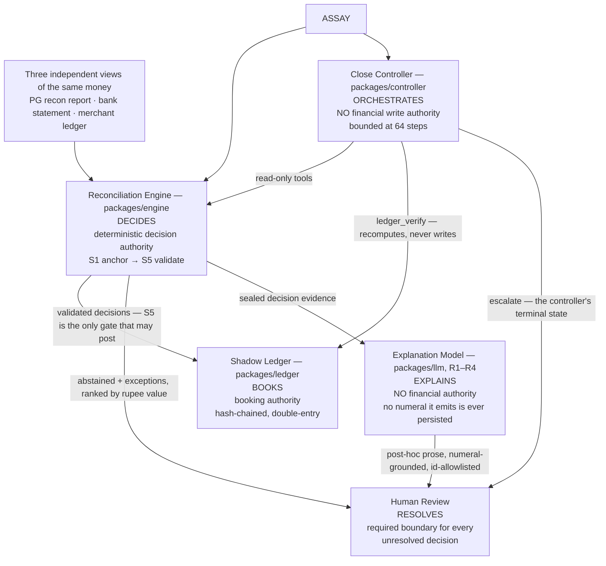

# ASSAY

**A settlement-reconciliation finance controller for Razorpay-shaped payment
data.** Razorpay AI Buildathon 2026 — **Track 04: AI Finance Controller**.

ASSAY decides **what can be reconciled from the evidence**, **what must remain
unresolved**, and **when a case is routed to a human reviewer.** It reads three
independent views of the same money — the payment gateway's recon report, the
bank statement, and the merchant's own ledger — posts every decision into a
hash-chained double-entry shadow ledger, and **abstains with a machine-checkable
certificate** whenever the available evidence does not uniquely determine the
correct allocation.

## Who decides what

Five things act on a settlement here, and **only one of them may decide, only
one may book, and neither of those is a language model.** The diagram is the
whole control argument; `docs/ARCHITECTURE.md §2` draws the same boundaries in
full and `§4` states what each one prevents.

| Component | Authority it has | Authority it does not have |
|---|---|---|
| **Reconciliation Engine** | The only component that decides an allocation, and `S5` is the only gate that may post | — |
| **Shadow Ledger** | The only component that books; every entry is hash-chained and replayable | Cannot be written except through a `ValidatedDecision` `S5` constructed |
| **Close Controller** | Reads, plans, escalates, within a step bound | **No financial write.** Its tool surface is four reads; its terminal state is human review, never a ledger event |
| **Explanation Model** | Explains a decision that has already been made and sealed | **Not a financial authority.** It decides nothing, emits no number that is persisted, and every id it names must already exist |
| **Human Review** | Resolves what the evidence could not | — |

**Unresolved decisions do not clear themselves.** An abstention or an exception
leaves the machine at a human, by construction — the escalation boundary is
where the system stops, not a fallback it takes when a heuristic is unsure.

## What is built

- **Ten packages and three apps**, committed — `money`, `domain`, `ledger`,
  `engine`, `probe`, `oracle`, `generator`, `eval`, `llm`, `controller`, and
  `apps/cli`, `apps/api`, `apps/web`.
- **3,673 tests across 151 files**, with no type errors.
- **A sealed, signed benchmark** — spec version 1.4.38, benchmark version
  1.0.13, tag `bench-v1.0.13`. `docs/PREREGISTRATION.md §9`'s eight steps were
  executed in order; step 7 wrote **50 conforming `metrics.json`** — five agents
  (`ASSAY`, `B0-IDONLY`, `A1-NOVALIDATE`, `A2-NOABSTAIN`, `A3-NOLLM`) × ten TEST
  seeds under `--llm=offline` — committed under
  [`runs/seal-v1.0.13/test/`](runs/seal-v1.0.13/test).
- **Byte-identical reproduction** — the same seed regenerates the same corpus
  byte for byte, and the same events rebuild the same ledger root hash; both are
  pinned by tests rather than asserted in prose.

**Three of `docs/DECISION_BRIEF.md §C`'s thirteen Tier-0 rows are not complete.**
They are named — not counted as done — in the disclosures below, alongside what
the sealed run does and does not support.

### Track 04's three asks, and the evidence for each

| Ask | The figure | Read from | Kind |
|---|---|---|---|
| **Throughput** | **15,726 observations per run** — TEST seeds `9000`–`9004`; 10,486 on the five adversarial seeds `9100`–`9104` | [`bench/test/<seed>/observations.jsonl`](bench/test), run end to end into [`runs/seal-v1.0.13/test/`](runs/seal-v1.0.13/test) | **Measured** — corpus volume per run, **not a rate** |
| **Measured accuracy** | `coverage_by_value` **0.9639 – 1.0000** per seed, published beside three lower coverage views | [`metrics.json`](runs/seal-v1.0.13/test) per seed; all four views, with numerators, under *Benchmark disclosures* | **Measured**, with the limitations below |
| **Honest exception list** | **3,770 – 3,787** open exceptions per seed (2,466 – 2,473 on `9100`–`9104`), each a value-ranked **Investigation Queue** row classed by `docs/DATA_MODEL.md §15`'s 14-member closed taxonomy | Same `metrics.json` for the counts; [`demo/README.md`](demo/README.md) names every exception the demo periods hold | **Measured** counts; the queue is a **demonstration** |

Every figure is a per-seed value read from a committed artifact. **None is
averaged and no aggregate exists** — `docs/EVALUATION_SPEC.md §5.5` admits only
numbers that are already in a run artifact, and the bootstrap that would produce
an interval is not built.

**Three things this benchmark does not measure, stated here rather than left to
be assumed:**

- **No aggregate accuracy metric.** There is no single accuracy number, and none
  is constructed for this table.
- **Not abstention accuracy.** `truly_ambiguous`, `abstentions` and
  `probes_spent` are `0` on all 50 scored units, so the corpus never posed the
  question — `V35`. The mechanism is shown on `demo/` fixtures, which are a
  demonstration and never evidence.
- **Not exception-class accuracy.** `exception_class_confusion` is
  `NOT COMPUTABLE` on the frozen population. The *list* is honest; its
  classification is unscored.

`V36` adds the one further caveat that matters here: `balance_harm_inr` and the
three metrics derived from it measure this corpus's bank-attribution rate, **not**
ASSAY's accounting accuracy. Both disclosures are below, in full.

## Run the demo

The demo is the web product, not the CLI. `docs/PROJECT_SPEC.md §10`'s script is
written against `assay run` / `assay verify` / `assay bench`, and the first two
refuse for the reason the disclosures below give — so the working path is:

    pnpm run dev         # apps/api on 127.0.0.1:8787; apps/web on the port Vite prints

**Open the URL Vite prints, not a remembered one.** `apps/web/vite.config.ts`
asks for `5173`, but Vite does not hold that port: with `strictPort` unset it
takes the next free one — `5174`, `5175` and so on — when something already has
`5173`, and prints the URL it actually bound. The API address is fixed at
`127.0.0.1:8787`, because the frontend proxies `/api` there and that target is
configured rather than negotiated. Then pick one of the four demo periods and
run it.
Everything is `--llm=offline` and needs no credential; the AI explanation panel
is the one surface that calls a metered provider, and every other panel answers
identically whether it is configured or absent.

**The API does not hot-reload — restart it after pulling a new revision.**
`apps/web` is served by Vite and picks up a change immediately; `apps/api` is a
plain Node process started by `pnpm run dev` and keeps serving the build it
started with, so a frontend talking to a stale API is the one confusing state
this setup can reach. Stop it and run `pnpm run dev` (or `pnpm run dev:api`)
again after every pull. Runs live in that process's memory, so a restart also
drops every run started before it.

| Period | What it holds | What the close controller does with it |
|---|---|---|
| `demo-500` | One settlement whose evidence admits two allocations | Escalates 1 of 26 queue rows — the other 25 open no Suspense item |
| `demo-close` | The same traffic with the ambiguity withheld | Reads the gate, finds `CLOSED`, stops in 3 steps |
| `demo-multi` | Four unattributed bank credits on top of the ambiguity | Plans 4, escalates under both reasons |
| `demo-backlog` | Twenty-four unattributed bank credits | Hits its 64-step bound and reports a partial result as partial |

The right-hand column is what the controller was observed to do, not a
prediction the UI makes: `apps/web` renders `@assay/controller`'s actual trace,
and `apps/api/tests/scenarios.test.ts` pins these outcomes.

**All four are `demo/` fixtures.** `demo/README.md` states the five boundaries in
full: outside `bench/`, no seed, no ground truth, never scored, and never usable
to support a claim about coverage, accuracy or harm.

### The two screens this submission is judged on

Both are reached from `demo-500` in under a minute, and both are stated here as
what to look at rather than shown, because **no screenshot has been captured in
this repository and none is fabricated.** The environment that produced this
checkpoint cannot render a browser — its Chromium fails to load
`libasound.so.2` — so the capture is the one remaining operator-side step, and
the runbook below is exact rather than approximate.

1. **The Ambiguity Certificate.** Solution A and Solution B side by side with
   their allocations tied out, an **evidence gap of `0` bps against an ε of
   `1500` bps**, and the abstention stated as the consequence of that
   comparison. This is the product's whole argument: two hypotheses the
   evidence cannot separate, and a machine-checkable record of declining to
   pick one.
2. **The controller outcome.** `ESCALATED`, with `STEPS 10 / 64`,
   `TOOL CALLS 4`, `ESCALATIONS 1` and `WRITES APPLIED 0` — a bounded agent
   that read four times, wrote nothing, and stopped at a human.

How to capture them

    pnpm run dev       # restart it — apps/api does not hot-reload

Open the URL Vite prints, select **`demo-500`**, and press **Run this period**.

**Screenshot 1 — Ambiguity Certificate.** Investigation Queue → the `ABSTAINED`
row (the only one carrying a certificate) → **Ambiguity Certificate**. Frame it
from the certificate seal down to the abstention callout, so that *Hypothesis
Comparison* (Solution A / Solution B, allocations aligned against the same
target) and *Evidence Score Comparison* (`0 bps` / `1500 bps`) are both in
shot. The AI panel sits below the callout and stays out of frame; it is a
button until it is pressed, and pressing it is the only surface in this app
that spends a metered call. Candidate ids are 69 characters and render
truncated through `CopyId` — if a full `cand_…` string is visible, the frame is
showing a copied value rather than the page. Capture the page region, not the
window: no browser chrome.

**Screenshot 2 — Controller outcome.** Stay on the Command Center and scroll to
**Finance Controller**; it runs itself once the period has run, so there is no
second button to press. Frame the outcome strip and the counters — `ESCALATED`,
`STEPS 10 / 64`, `TOOL CALLS 4`, `ESCALATIONS 1`, `WRITES APPLIED 0` — and stop
above *Supporting evidence*; the step-by-step trace below it is detail, not the
result. `apps/api/tests/controller.test.ts` and `apps/api/tests/scenarios.test.ts`
pin every one of those five figures, so a capture disagreeing with them is a
stale API rather than a new result.

Save them as `docs/screenshots/01-ambiguity-certificate.png` and
`docs/screenshots/02-controller-outcome.png`, then link them here. **Until they
exist, this section names them and shows nothing** — a placeholder image in a
finance repository is the one thing worse than no image.

## Read the specification in this order

| # | Document | What it settles |
|---|----------|-----------------|
| 0 | [`docs/DECISION_BRIEF.md`](docs/DECISION_BRIEF.md) | Verdict, locked scope, risks, build order. **Start here.** |
| 1 | [`docs/PROJECT_SPEC.md`](docs/PROJECT_SPEC.md) | Product, users, workflow, non-goals, track alignment |
| 2 | [`docs/ARCHITECTURE.md`](docs/ARCHITECTURE.md) | Components, data flow, trust boundaries |
| 3 | [`docs/DATA_MODEL.md`](docs/DATA_MODEL.md) | Every entity and its exact schema |
| 4 | [`docs/RECONCILIATION_SPEC.md`](docs/RECONCILIATION_SPEC.md) | The matching algorithm and abstention rules |
| 5 | [`docs/PREREGISTRATION.md`](docs/PREREGISTRATION.md) | Frozen benchmark methodology. **Signed before results exist.** |
| 6 | [`docs/EVALUATION_SPEC.md`](docs/EVALUATION_SPEC.md) | Metrics, baselines, ablations, reporting |
| 7 | [`docs/THREAT_MODEL.md`](docs/THREAT_MODEL.md) | Attacker model and mitigations |
| 8 | [`docs/RELATED_WORK.md`](docs/RELATED_WORK.md) | Prior art and where ASSAY actually differs |

## Benchmark disclosures

What the sealed benchmark does and does not support

**Status: the product path is built end to end and the benchmark is sealed
and scored. Three of `docs/DECISION_BRIEF.md §C`'s thirteen Tier-0 rows are
not complete, and they are named below rather than counted as done.**

**Read the sealed artifacts with `docs/PREREGISTRATION.md §10`'s amendment register
open.** It records what the run does *not* support, and the following are the
load-bearing rows.

**V35 — the sealed TEST population exercises none of the ambiguity, abstention
or validation machinery.** `truly_ambiguous`, `abstentions` and `probes_spent`
are `0` on all 50 units, and `ASSAY`, `A1-NOVALIDATE`, `A2-NOABSTAIN` and
`A3-NOLLM` are numerically identical on every reported figure. The ablations
control nothing on this corpus, so `docs/PROJECT_SPEC.md §7` **S6 is untested
rather than met** — a weaker statement than a negative result, and the honest
one. The only material separation anywhere in the run is `ASSAY` against
`B0-IDONLY` on seeds `9100`–`9104`, and V35 reports its direction both ways.
What the sealed corpus therefore cannot measure about abstention is stated in
full below, with the figures it was read from.

**V36 — `docs/PROJECT_SPEC.md §7` S3 is not met on the frozen TEST corpus, and
the cause is structural rather than an ASSAY posting-rule defect.** `ASSAY`'s
`balance_harm_paise` is **1.23×–1.50× `batch_value_paise`** across the ten seeds,
against S3's bar of 0.05%. `docs/EVALUATION_SPEC.md §4.4(a)`'s `proj_truth`
joins truth's journal to the covered set on `source_entity_id` alone, and truth
posts both the `P1` capture leg and the `P2` bank leg of a payment under the same
`pay_…` key — while `docs/DATA_MODEL.md §17.1.1` correctly withholds `P2`/`P4`
unless `AN2` bank evidence exists, and `§4.2` freezes `bank_ref` quality at *"30%
a clean UTR, 70% absent or non-UTR"*. A conforming agent is therefore charged, in
full, the bank leg the specification forbids it to post. ASSAY's posting
behaviour is conformant and the `P2` path demonstrably fires wherever `AN2`
holds; on this corpus `balance_harm_inr` measures the benchmark's
bank-attribution rate, not ASSAY's accounting accuracy. **Metrics 2
`net_cost_inr`, 3 `aurc_paise` and 8 `gap_to_oracle` all take `balance_harm_inr`
as an input and inherit that limitation in full; none of them may be presented as
independent evidence of accounting accuracy on this corpus.** Nothing was
changed to accommodate this: no benchmark data, threshold, metric formula,
posting rule or engine behaviour moved, and no re-run or re-score was performed.
A repair belongs to a future `BENCHMARK_VERSION` with fresh seeds. V36 records
the measurement, the reproduction and the rejected alternatives.

**Coverage, all four published views, `ASSAY` across the ten sealed TEST
seeds.** `docs/EVALUATION_SPEC.md §4.1` defines four and `§5.2` requires them
shown together, because a run can reconcile almost all gateway-side value while
the bank statement is largely untied. Each is a per-seed range read from the
committed `runs/seal-v1.0.13/test/<seed>/ASSAY/offline/metrics.json`; none is
averaged, and no figure here is recomputed.

| View | Numerator ÷ denominator | Range over the ten seeds |
|---|---|---|
| `coverage_by_value` — the headline | `Σ recon_line.amount` RECONCILED ÷ `Σ recon_line.amount` | **0.9639 – 1.0000** |
| `coverage_by_value_all_observations` | RECONCILED value ÷ value of **all** observations | 0.5437 – 0.5965 |
| `coverage_by_value_bank` | `Σ bank_line.amount` RECONCILED ÷ `Σ bank_line.amount` | 0.2090 – 0.3763 |
| `coverage_by_value_ledger` | `Σ ledger_entry.gross_paise` RECONCILED ÷ same | **0.0000** on every seed |

The headline is a **recon-view** figure and is not total financial coverage.
The bank view is bounded by `AN2` alone (`§10` **V18**) and the ledger view is
`0.0000` **by construction** because anchor `AN5` is retired (`§4.1`, `§10`
**V12**) — a scope statement, not a performance result. The audit line
`coverage_by_value_all_observations` is `EXPLORATORY` and supports no claim.
The same `AN2` bound is what **V36** above identifies as the cause of the S3
harm figure.

**The sealed corpus does not measure abstention, and the mechanism is shown
elsewhere.** `truly_ambiguous`, `abstentions` and `probes_spent` are `0` on all
50 scored units, so the oracle marked **no** target ambiguous on any TEST seed
and the abstention path was never entered. There is therefore **no abstention
rate, no abstention precision and no probe figure** this benchmark can report,
and none is claimed. The ambiguity and abstention machinery is demonstrated
instead in the controlled scenario lab under [`demo/`](demo) — a
**demonstration, not a measurement**, whose five boundaries `demo/README.md`
states in full: outside `bench/`, no seed, no ground truth, never scored, and
never usable to support a claim about coverage, accuracy or harm.

**No aggregates exist.** `docs/EVALUATION_SPEC.md §5.2`'s bootstrap is not
implemented at this checkpoint, so there is no cross-seed mean, no ± 95% CI and
no CI-overlap verdict for any figure; every number in the artifacts is a
per-scored-unit value, which is the only form `§5.5` permits. `--llm=replay`
was not run, so metric 24 `offline_parity` is unavailable, and
`B2-LLM-DIRECT` is not built — withdrawing **S7** rather than claiming it.

**One measured result has no register row yet, and is stated here rather than
omitted.** Metric 15 `injection_financial_success_rate`, which
`docs/EVALUATION_SPEC.md §4.8` expects to be *"structurally zero"* for `ASSAY`,
reads `0.187`–`0.209` across the five adversarial TEST seeds `9100`–`9104`
(250–257 injected cases per seed, 47–53 of them carrying a positive per-case
`balance_harm`). **`§7` S9 is therefore not met as stated.** `§10` **V30** is
the context for reading it: metric 15's per-case `balance_harm` is a
decomposition adopted by ratification and is *not* a partition of `§4.4(a)`'s
run-level `balance_harm_inr`, so the figure is the share of injected cases
carrying their own non-zero account-level difference — not a count of
injections that moved money. A `§10` row recording the measurement and settling
its reading is **outstanding**.

**The three incomplete Tier-0 rows, named.** **T0-9**'s bootstrap CIs are not
implemented, which is why no aggregate above carries an interval. **T0-11**
lists eight `apps/cli` commands and four of them refuse — `assay run`, `assay
close`, `assay report`, and `assay verify` without `--events` — each exiting
with an `UnavailableStageError` that names its missing dependency: `S0`'s
orchestration belongs to `packages/domain` and is not written,
`packages/ledger`'s mutating write path and `docs/ARCHITECTURE.md §8`'s SQLite
persistence do not exist, and `packages/eval/src/report/` is not written.
**T0-13**'s static benchmark report is that last one, and is absent rather
than rendered from numbers it cannot source — `docs/EVALUATION_SPEC.md §5.5`
admits only figures that exist in a committed run artifact. **T0-10**'s
`B2-LLM-DIRECT` is deferred under the condition its own row sets (`§F` F2),
which is the row being satisfied rather than missed.

**What runs instead.** The scored sweep and the product API both drive the
pipeline through `@assay/cli`'s composed run, not through `assay run`; `assay
generate`, `oracle`, `bench` and `seal` are built and produced the sealed
corpus and its 50 artifacts. The close controller performs **no financial
write** on any path — its tool surface is four reads.

## Data provenance

**ASSAY's benchmark is synthetic.** Razorpay Test Mode exposes the settlement and
recon endpoints but contains no settlement records (`count: 0`), so no real
settlement data was used or could be used. Real API contracts and real test-mode
objects were used to calibrate the schema, arithmetic and identifier grammars of
a programmatically generated financial universe. No external validity is claimed
— see `docs/PREREGISTRATION.md §2` and §10.

Every statement this specification makes about Razorpay behaviour is classified as
**documented**, **an ASSAY modelling assumption**, or **explicitly not claimed**.
The full register is `docs/DATA_MODEL.md §22`.

## Schedule

Tier-0 scope (`docs/DECISION_BRIEF.md §C`) was frozen on **31 August 2026**.
Benchmark seal and sealed run: **1 September** — done, tag `bench-v1.0.13`.
Submission: **5 September**.

## Credentials

API keys live in `.env`, which is gitignored. They are never written into source,
documentation, prompts, fixtures, or commit history.

`.env.example` is the documented template: copy it to `.env` at the repository
root and fill in the values there. The API reads the file through Node's own
`--env-file-if-exists`, wired into `apps/api`'s own `dev` script — there is no
dotenv dependency and no loader. That script is the single definition of how the
server starts, so every command below launches an API with the same environment;
`if-exists` is what keeps a clean checkout with no `.env` starting normally.

    pnpm run check:env   # provider / model / <selected provider's key>=set|missing
    pnpm run dev:api     # start apps/api alone, with .env loaded
    pnpm run dev         # start apps/api and apps/web together

`check:env` reports whether the credential **the selected provider actually
reads** is present, and never prints it — `ANTHROPIC_API_KEY` on the default
`anthropic` path, `GEMINI_API_KEY` when `ASSAY_EXPLAIN_PROVIDER=gemini`. The
API itself prints the provider and model it resolved as its second startup line,
so a `.env` that did not reach the server is visible before any request is made.

Consumer AI subscriptions (Claude Pro, ChatGPT Go, Google AI Pro and equivalents)
are **not** API credentials and are never used as such. The only supported live
path is a metered API key; the default `offline` provider needs none.
